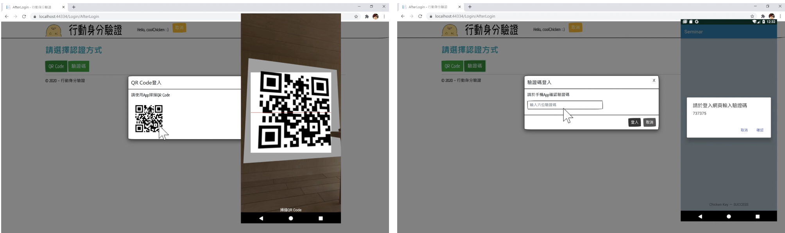

# FIDO 行動身份驗證 App

- [English Version](README.md)
- 以 **Android(Java) App** 與 **網頁(ASP.NET MVC)** 結合的 **FIDO 行動身份驗證 App**。與國泰醫院合作，目的為**綁定手機 IMEI 碼，以進行身份驗證**，使得未攜帶健保卡亦能夠看診。功能：*App 掃描網頁 QRCode* / *網頁輸入 App 驗證碼* 進行綁定手機 IMEI 碼。



## 系統需求
- **Android App**
    - **開發工具**: Android Studio 4.1.1 以上 (建議使用最新版本)
    - **JDK**: 1.8 (Java 8 相容)
    - **Android SDK**:
        - Compile SDK Version: 29
        - Target SDK Version: 29
        - Min SDK Version: 19
    - **裝置需求**:
        - Android 手機/平板，Android 4.4 (KitKat, API 19) 以上

- **網頁**
    - **IDE**：Visual Studio 2019 或 2022（含 .NET 開發）
    - **資料庫**：MySQL


## 專案結構
```bash
FIDO_Auth/                  
├─ app/src/main/java/com/fju/seminar
│  ├─ Biometrics.java           # 使用生物驗證登入
│  ├─ DeviceBind.java           # 裝置綁定
│  ├─ LoginActivity.java        # 登入
│  ├─ MainActivity.java         # 首頁
│  ├─ QRLogin.java              # QRCode 綁定
│  ├─ WebLogin.java             # 驗證碼綁定
│  └─ WelcomeActivity.java      # App 啟動介面
├─ Web
│   ├─ Controllers
│   │  ├─ RegisterController.cs # 控制註冊介面
│   │  └─ HomeController.cs     # 控制首頁
│   ├─ Models                   # 自動產生檔
│   ├─ Views
│   │  ├─ Home                  # 介面：首頁、關於、聯繫
│   │  ├─ Register              # 註冊相關介面，如：CRUD 裝置
│   │  └─ Shared                # 共享介面，如：發生錯誤
│   └─ ...
└─ ...                           
```
